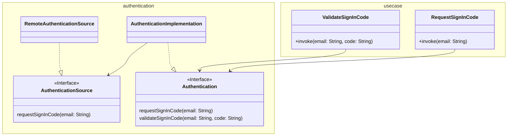

```mermaid
classDiagram
direction TB
	namespace usecase {
        class RequestSignInCode {
	        +invoke(email: String)
        }

        class ValidateSignInCode {
	        +invoke(email: String, code: String)
        }

	}
	namespace authentication {
        class AuthenticationImplementation {
        }

        class AuthenticationSource {
	        requestSignInCode(email: String)
        }

        class RemoteAuthenticationSource {
        }

        class Authentication {
	        requestSignInCode(email: String)
	        validateSignInCode(email: String, code: String)
        }

	}

	<<Interface>> AuthenticationSource
	<<Interface>> Authentication

    RequestSignInCode --> Authentication
    ValidateSignInCode --> Authentication
    AuthenticationImplementation ..|> Authentication
    AuthenticationImplementation --> AuthenticationSource
    RemoteAuthenticationSource ..|> AuthenticationSource
```