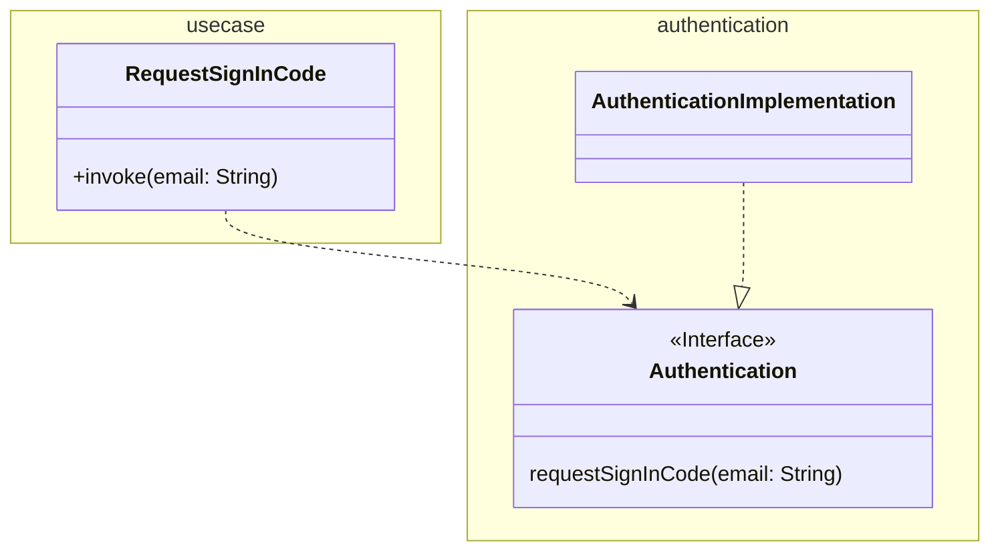

```mermaid
classDiagram
direction TB
	namespace usecase {
        class RequestSignInCode {
	        +invoke(email: String)
        }

	}
	namespace authentication {
        class Authentication {
	        requestSignInCode(email: String)
        }

        class AuthenticationImplementation {
        }

	}

	<<Interface>> Authentication

    RequestSignInCode ..> Authentication
    AuthenticationImplementation ..|> Authentication   
```