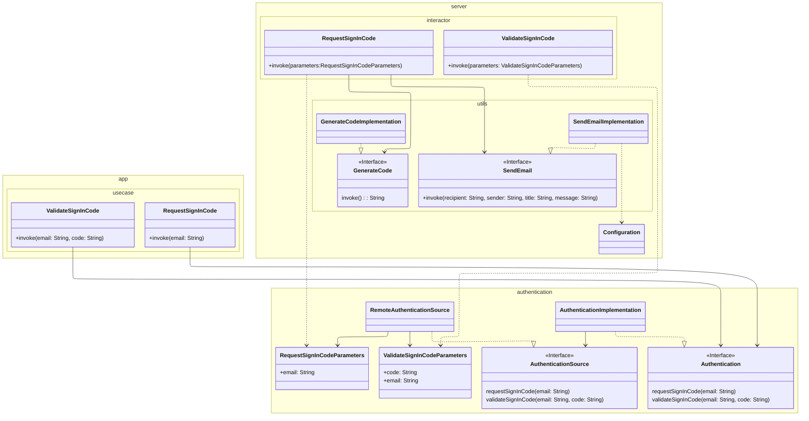

```mermaid
---
config:
  layout: elk
---
classDiagram
direction TB
	namespace `app.usecase` {
        class RequestSignInCode {
	        +invoke(email: String)
        }

        class ValidateSignInCode {
	        +invoke(email: String, code: String)
        }

	}
	namespace authentication {
        class AuthenticationImplementation {
        }

        class RemoteAuthenticationSource {
        }

        class Authentication {
	        requestSignInCode(email: String)
	        validateSignInCode(email: String, code: String)
        }

        class AuthenticationSource {
	        requestSignInCode(email: String)
	        validateSignInCode(email: String, code: String)
        }

        class RequestSignInCodeParameters {
	        +email: String
        }

        class ValidateSignInCodeParameters {
	        +code: String
	        +email: String
        }

	}
	namespace `server.interactor` {
        class RequestSignInCode_3["RequestSignInCode"] {
	        +invoke(parameters:RequestSignInCodeParameters)
        }

        class ValidateSignInCode_3["ValidateSignInCode"] {
	        +invoke(parameters: ValidateSignInCodeParameters)
        }

	}
	namespace server {
        class Configuration {
        }

	}
	namespace `server.utils` {
        class SendEmailImplementation {
        }

        class SendEmail {
	        +invoke(recipient: String, sender: String, title: String, message: String)
        }

        class GenerateCode {
	        invoke() : String
        }

        class GenerateCodeImplementation {
        }

	}

	<<Interface>> Authentication
	<<Interface>> AuthenticationSource
	<<Interface>> SendEmail
	<<Interface>> GenerateCode

    RequestSignInCode --> Authentication
    ValidateSignInCode --> Authentication
    AuthenticationImplementation ..|> Authentication
    AuthenticationImplementation --> AuthenticationSource
    RemoteAuthenticationSource ..|> AuthenticationSource
    RemoteAuthenticationSource --> RequestSignInCodeParameters
    RemoteAuthenticationSource --> ValidateSignInCodeParameters
    RequestSignInCode_3 ..> RequestSignInCodeParameters
    ValidateSignInCode_3 ..> ValidateSignInCodeParameters
    RequestSignInCode_3 --> SendEmail
    SendEmailImplementation ..|> SendEmail
    SendEmailImplementation ..> Configuration
    RequestSignInCode_3 --> GenerateCode
    GenerateCodeImplementation ..|> GenerateCode
```